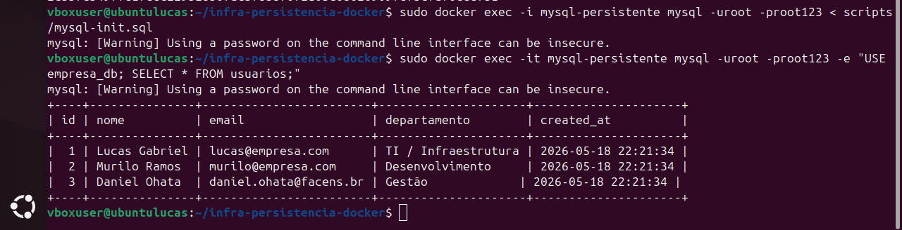
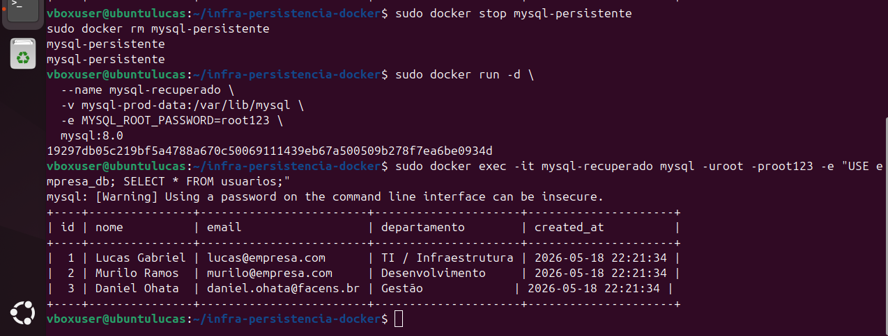
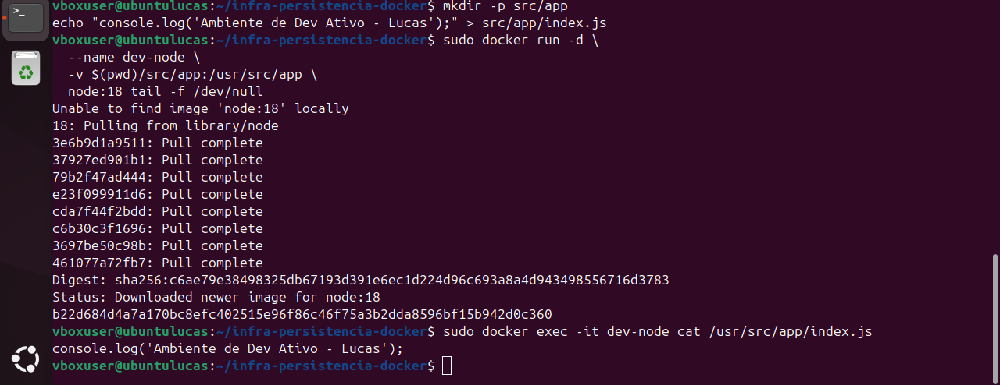
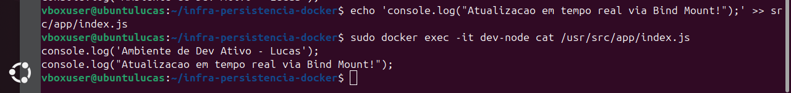
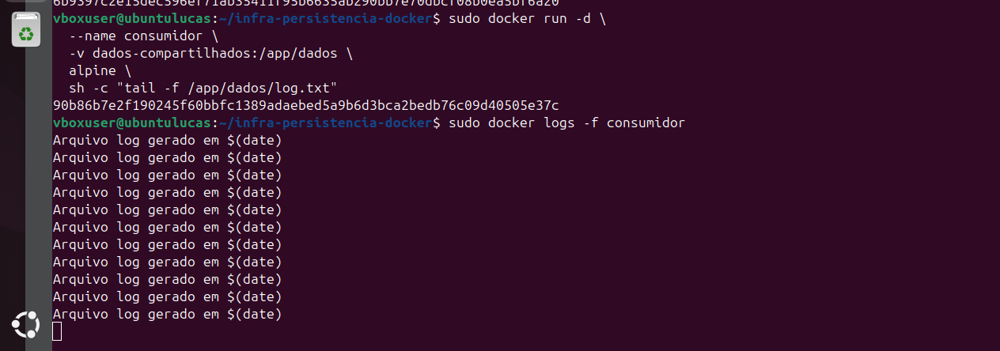
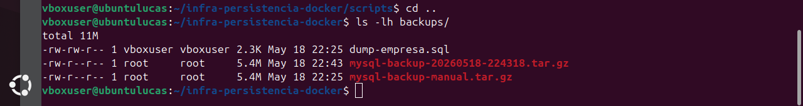

# AC2 — Infraestrutura de Persistência e Volumes Docker 🐳💾

**Aluno:** Lucas Gabriel de Campos Queiroz
**RA:** 247468
**Curso:** Gestão de T.I (FACENS)

---

## ✅ 1. Introdução

Containers Docker são, por natureza, **efêmeros**: ao remover/recriar um container, tudo que estava no sistema de arquivos interno pode ser perdido. Em infraestrutura moderna, isso é crítico para **bancos de dados**, **logs** e **artefatos** que precisam sobreviver ao ciclo de vida do container.

Para resolver isso, utilizamos **volumes**, que desacoplam os dados do container, permitindo persistência e compartilhamento entre serviços. Nesta atividade, foram aplicados:

- **Named Volumes**: volumes gerenciados pelo Docker, ideais para dados de banco.
- **Bind Mounts**: pasta do host montada no container (uso típico em desenvolvimento).
- **Compartilhamento de Volumes**: múltiplos containers acessando o mesmo armazenamento.
- **Backup/Restore** e **automação** via script Bash.

🎯 **Objetivo:** executar 5 cenários práticos e documentar comandos, validações, evidências e troubleshooting, permitindo que outro usuário reproduza parcialmente os cenários usando apenas este README.

---

## 🖥️ 2. Ambiente Utilizado

- **S.O.:** Ubuntu 24.04 LTS (VirtualBox) — usuário `vboxuser@ubuntulucas`
- **Docker Engine:** Docker version 24.0.7
- **Docker Compose:** **não utilizado** (atividade feita “no braço” com `docker run`/`docker volume`)
- **Hardware (VM):** 4 GB RAM / 2 vCPUs

> 🔎 Observação: as versões foram informadas conforme o ambiente utilizado no laboratório.  
> Recomenda-se validar localmente com os comandos abaixo, caso necessário.

### (Opcional) Comandos para conferir o ambiente
```bash
lsb_release -a
docker --version
free -h
lscpu
```

---

## 🧱 3. Desenvolvimento da Atividade

### Pré-requisitos
- Docker instalado e funcionando ✅
- Estrutura mínima de pastas no projeto:
  - `backups/`
  - `scripts/`
  - `src/`
  - `screenshots/` (evidências)

Criar pastas (se necessário):
```bash
mkdir -p backups scripts src screenshots
mkdir -p screenshots/cenario1 screenshots/cenario2 screenshots/cenario3 screenshots/cenario4 screenshots/cenario5
```

> ℹ️ Observação: no meu ambiente, utilizei `sudo docker ...`. Caso seu usuário esteja no grupo `docker`, pode executar sem `sudo`.

---

# 🧩 CENÁRIO 1 — Persistência de Dados com MySQL e Named Volume

🎯 **Objetivo:** validar persistência de dados após remover/recriar containers usando **Named Volume**.

## 🔎 Conceito técnico (como funciona)
O MySQL grava os dados em **`/var/lib/mysql`**. Ao montar um **volume nomeado** nesse caminho, os dados ficam fora do container e persistem mesmo que o container seja removido.

---

## ✅ Etapa 1 — Criar volume nomeado
```bash
docker volume create mysql-prod-data
```

## ✅ Etapa 2 — Criar container MySQL com volume persistente
```bash
docker run -d \
  --name mysql-persistente \
  -v mysql-prod-data:/var/lib/mysql \
  -e MYSQL_ROOT_PASSWORD=root123 \
  -p 3306:3306 \
  mysql:8.0
```

> ⏳ Dica: aguarde alguns segundos para o MySQL inicializar.

## ✅ Etapa 3 — Criar banco, tabela e inserir registros (mínimo 3)

Arquivo: `scripts/mysql-init.sql`
```sql
CREATE DATABASE IF NOT EXISTS empresa_db;
USE empresa_db;

CREATE TABLE IF NOT EXISTS usuarios (
  id INT AUTO_INCREMENT PRIMARY KEY,
  nome VARCHAR(100) NOT NULL,
  email VARCHAR(120) NOT NULL,
  departamento VARCHAR(80) NOT NULL,
  created_at TIMESTAMP DEFAULT CURRENT_TIMESTAMP
);

INSERT INTO usuarios (nome, email, departamento) VALUES
('Lucas Gabriel', 'lucas@empresa.com', 'TI / Infraestrutura'),
('Murilo Ramos', 'murilo@empresa.com', 'Desenvolvimento'),
('Daniel Ohata', 'daniel.ohata@facens.br', 'Gestão');
```

Executar o script:
```bash
docker exec -i mysql-persistente mysql -uroot -proot123 < scripts/mysql-init.sql
```

Validar inserção (consulta):
```bash
docker exec -it mysql-persistente \
  mysql -uroot -proot123 \
  -e "USE empresa_db; SELECT * FROM usuarios;"
```

## ✅ Etapa 4 — Validar persistência (remover e recriar container)

Remover o container (sem apagar o volume):
```bash
docker stop mysql-persistente
docker rm mysql-persistente
```

Recriar usando o mesmo volume:
```bash
docker run -d \
  --name mysql-recuperado \
  -v mysql-prod-data:/var/lib/mysql \
  -e MYSQL_ROOT_PASSWORD=root123 \
  mysql:8.0
```

Validar permanência dos dados:
```bash
docker exec -it mysql-recuperado \
  mysql -uroot -proot123 \
  -e "USE empresa_db; SELECT * FROM usuarios;"
```

---

## ✅ Validações e Evidências (Cenário 1)

**Cenário 1: Evidência 1 e 2 (SELECT com 3 registros + recuperação após rm/run)**

- **Evidência 1 — SELECT com 3 registros (prova inserção):**  
  

- **Evidência 2 — Stop/RM + Run novo + SELECT (prova persistência):**  
  

---

# 🗃️ CENÁRIO 2 — Backup e Restauração de Volume

🎯 **Objetivo:** compreender estratégias de backup e recuperação com:
- **mysqldump** (backup lógico)
- **tar.gz do volume** (backup físico)

## 🔎 Conceito técnico (diferença)
- **mysqldump**: exporta o banco em formato SQL (lógico).
- **tar.gz do volume**: captura o conteúdo do armazenamento (físico), útil para restauração rápida do ambiente do banco.

---

## ✅ Etapa 1 — Executar mysqldump (backup lógico)
```bash
docker exec mysql-recuperado \
  mysqldump -uroot -proot123 empresa_db > backups/dump-empresa.sql
```

## ✅ Etapa 2 — Backup físico do volume em `.tar.gz`
```bash
docker run --rm \
  -v mysql-prod-data:/dados:ro \
  -v "$(pwd)/backups":/backup \
  alpine tar czf /backup/mysql-backup-manual.tar.gz -C /dados .
```

Conferir arquivos gerados:
```bash
ls -lh backups/
```

## ✅ Etapa 3 — Restauração no volume original (recuperação “onde os dados pertencem”)

> ✅ Nesta atividade, o restore foi realizado **no mesmo volume `mysql-prod-data`**, injetando os dados de volta no local correto.

Arquivo: `scripts/restore.sh` (recomendado para padronizar)
```bash
#!/bin/bash
set -e

VOLUME="mysql-prod-data"
ARQ="../backups/mysql-backup-manual.tar.gz"

echo "[INFO] Restaurando backup no volume: $VOLUME"
docker run --rm \
  -v ${VOLUME}:/dest \
  -v "$(pwd)/.."/backups:/backup \
  alpine tar xzf /backup/mysql-backup-manual.tar.gz -C /dest

echo "[SUCESSO] Restore concluído no volume: $VOLUME"
```

Executar o restore:
```bash
chmod +x scripts/restore.sh
cd scripts
sudo ./restore.sh
cd ..
```

Subir MySQL apontando para o volume restaurado:
```bash
docker run -d \
  --name mysql-restaurado \
  -v mysql-prod-data:/var/lib/mysql \
  -e MYSQL_ROOT_PASSWORD=root123 \
  mysql:8.0
```

Validar funcionamento (consulta):
```bash
docker exec -it mysql-restaurado \
  mysql -uroot -proot123 \
  -e "USE empresa_db; SELECT * FROM usuarios;"
```

---

## ✅ Validações e Evidências (Cenário 2)

**Cenário 2: Evidência 3 e 4 (mysqldump + ls mostrando dump e .tar.gz)**

- **Evidência 3 — mysqldump (prova dump gerado):**  
  

- **Evidência 4 — ls backups/ (prova dump + tar.gz no diretório):**  
  

---

# 🔁 CENÁRIO 3 — Bind Mount e Desenvolvimento

🎯 **Objetivo:** demonstrar **Bind Mount** em ambiente de desenvolvimento (sincronização host ↔ container).

## 🔎 Conceito técnico (como funciona)
- **Bind Mount** monta uma pasta do **host** dentro do container.
- Alterações feitas no arquivo **no Host (Ubuntu)** aparecem **imediatamente** dentro do container (ótimo para desenvolvimento).

---

## ✅ Etapa 1 — Criar diretório local e arquivo (Host)
```bash
mkdir -p src/app
echo "console.log('Ambiente de Dev Ativo - Lucas');" > src/app/index.js
```

## ✅ Etapa 2 — Subir container Node montando a pasta do Host
```bash
docker run -d \
  --name dev-node \
  -v "$(pwd)/src/app":/usr/src/app \
  node:18 tail -f /dev/null
```

## ✅ Etapa 3 — Validar acesso dentro do container
```bash
docker exec -it dev-node cat /usr/src/app/index.js
```

## ✅ Etapa 4 — Alterar no Host e validar atualização no container (real-time)
```bash
echo 'console.log("Atualizacao em tempo real via Bind Mount!");' >> src/app/index.js
docker exec -it dev-node cat /usr/src/app/index.js
```

---

## ✅ Validações e Evidências (Cenário 3)

**Cenário 3: Evidência 5 e 6 (criação do index.js + atualização em tempo real)**

- **Evidência 5 — Criação + leitura do arquivo no container (prova bind mount):**  
  

- **Evidência 6 — Alteração no Host refletida no container (prova real-time):**  
  

---

# 🔗 CENÁRIO 4 — Compartilhamento de Dados Entre Containers

🎯 **Objetivo:** centralizar logs/arquivos com um **volume compartilhado** por dois containers:
- **produtor** (escreve no volume)
- **consumidor** (lê do volume em tempo real)

## 🔎 Conceito técnico
Um volume pode ser montado por múltiplos containers. Assim, um container escreve em um arquivo e outro container lê o mesmo arquivo, sem depender do filesystem interno do container.

---

## ✅ Etapa 1 — Criar volume compartilhado
```bash
docker volume create dados-compartilhados
```

## ✅ Etapa 2 — Container PRODUTOR (gera logs no volume)
```bash
docker run -d --name produtor \
  -v dados-compartilhados:/app/dados \
  alpine sh -c 'while true; do echo "Arquivo log gerado em $(date)" >> /app/dados/log.txt; sleep 2; done'
```

## ✅ Etapa 3 — Container CONSUMIDOR (lê logs do mesmo volume)
```bash
docker run -d \
  --name consumidor \
  -v dados-compartilhados:/app/dados \
  alpine sh -c "tail -f /app/dados/log.txt"
```

## ✅ Etapa 4 — Validar logs em tempo real
```bash
docker logs -f consumidor
```

---

## ✅ Validações e Evidências (Cenário 4)

**Cenário 4: Evidência 7 (docker run do consumidor + docker logs -f)**

- **Evidência 8 — Logs em tempo real, e execução do consumidor (prova do container com volume montado:**  
  

---

# 🤖 CENÁRIO 5 — Automação de Backup

🎯 **Objetivo:** automatizar backup do volume via script Bash gerando `.tar.gz` com timestamp.

## 🔎 Conceito técnico
Automação operacional reduz falhas humanas e padroniza rotinas. Aqui, o script executa o backup físico do volume e salva em `backups/` com nome único por timestamp.

---

## ✅ Etapa 1 — Script `scripts/backup.sh`

Arquivo: `scripts/backup.sh`
```bash
#!/bin/bash
set -e

VOLUME="mysql-prod-data"
DEST="../backups"
TS=$(date +%Y%m%d-%H%M%S)
ARQ="mysql-backup-$TS.tar.gz"

echo "[INFO] Iniciando backup do volume: $VOLUME"
mkdir -p "$DEST"

docker run --rm \
  -v ${VOLUME}:/dados:ro \
  -v "$(pwd)/${DEST}":/backup \
  alpine tar czf "/backup/${ARQ}" -C /dados .

echo "[SUCESSO] Backup concluído: ${ARQ}"
```

Dar permissão:
```bash
chmod +x scripts/backup.sh
```

## ✅ Etapa 2 — Executar o script
```bash
cd scripts
sudo ./backup.sh
cd ..
```

## ✅ Etapa 3 — Validar backups gerados
```bash
ls -lh backups/
```

---

## ✅ Validações e Evidências (Cenário 5)

**Cenário 5: Evidência 8 e 9 (execução do backup.sh + ls final com backups)**

- **Evidência 8 — Execução do script com sucesso:**  
  

- **Evidência 9 — Listagem final comprovando backups gerados:**  
  

---

## 🧾 4. Evidências (Prints / Logs / Resultados)

> ✅ Esta seção é um **índice geral** das evidências exigidas.  
> As comprovações também aparecem **dentro de cada cenário**, no tópico “Validações e Evidências”.

### CENÁRIO 1 — Persistência (MySQL + Named Volume)
- [Evidência 1](screenshots/cenario1/c1-e1-tabela.png)
- [Evidência 2](screenshots/cenario1/c1-e2-recuperacao.png)

### CENÁRIO 2 — Backup e Restauração
- [Evidência 3](screenshots/cenario2/c2-e3-dump.png)
- [Evidência 4](screenshots/cenario2/c2-e4-arquivos.png)

### CENÁRIO 3 — Bind Mount
- [Evidência 5](screenshots/cenario3/c3-e5-criacao.png)
- [Evidência 6](screenshots/cenario3/c3-e6-realtime.png)

### CENÁRIO 4 — Compartilhamento
- [Evidência 7](screenshots/cenario4/c4-e8-logs.png)

### CENÁRIO 5 — Automação
- [Evidência 8](screenshots/cenario5/c5-e9-script.png)
- [Evidência 9](screenshots/cenario5/c5-e10-final.png)

---

## 🛠️ 5. Problemas Encontrados (Troubleshooting Real)

### 1) Warning de segurança do MySQL no CLI
- **Problema:** `mysql: [Warning] Using a password on the command line interface can be insecure.`
- **Contexto:** ocorreu ao executar `mysql`/`mysqldump` com `-pSENHA` no terminal.
- **Solução/Boa prática:** para laboratório é aceitável; em produção recomenda-se uso de secrets/variáveis seguras e evitar expor senha no histórico do shell.

### 2) Falha de push no Git (conflito/refs)
- **Problema:** `error: failed to push some refs`
- **Contexto:** ocorreu durante a organização das pastas/arquivos no repositório.
- **Solução aplicada:** resolução de conflitos e ajuste do histórico (merge/rebase conforme o caso), garantindo envio correto para o remoto e mantendo o histórico de commits.

---

## 📁 Estrutura do Repositório

- `backups/` — arquivos gerados: `dump-empresa.sql`, `mysql-backup-manual.tar.gz`, `mysql-backup-*.tar.gz`
- `scripts/` — scripts utilizados: `mysql-init.sql`, `backup.sh`, `restore.sh`
- `screenshots/` — evidências (prints) organizadas por cenário (`cenario1` até `cenario5`)
- `src/` — código fonte (ex.: `src/app/index.js`)

---

## 🔗 Link do Repositório
https://github.com/LcasQueirxz/infra-persistencia-docker
