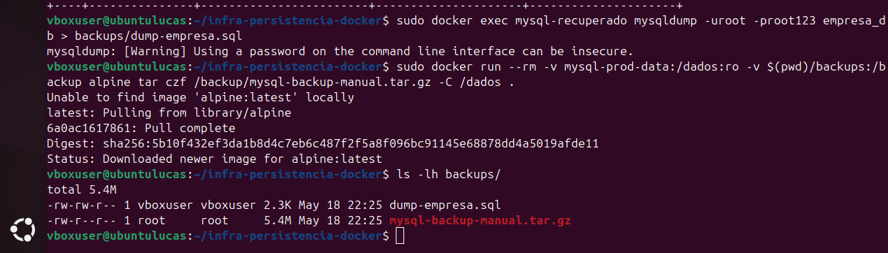
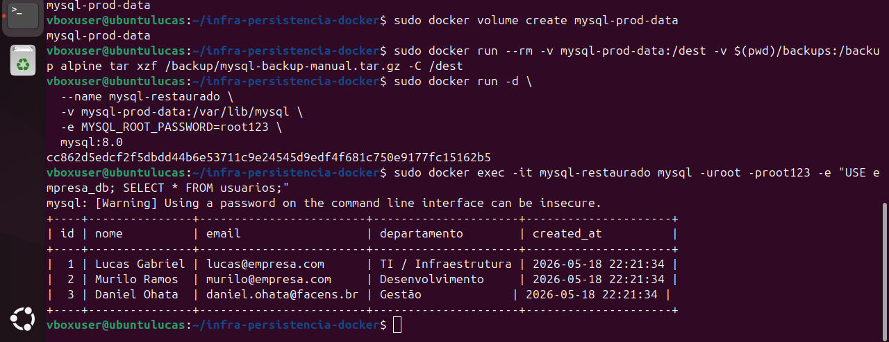

# AC2 — Infraestrutura de Persistência e Volumes Docker 🐳💾

**Aluno:** Lucas Gabriel de Campos Queiroz  
**Curso:** Gestão de T.I (FACENS)

---

## ✅ 1. Introdução

Containers Docker são, por natureza, **efêmeros**: ao remover/recriar um container, tudo que estava no sistema de arquivos interno pode ser perdido. Por isso, em cenários com banco de dados, logs e arquivos importantes, precisamos de **persistência** usando **volumes**.

Nesta atividade, foram aplicados conceitos de:
- **Named Volumes** (volumes gerenciados pelo Docker, ideais para dados do banco)
- **Bind Mounts** (pasta do host montada no container, muito usado em desenvolvimento)
- **Compartilhamento de volumes** (mais de um container usando o mesmo armazenamento)
- **Backup/Restore** e **automação operacional** via script Bash

🎯 **Objetivo:** executar 5 cenários práticos e documentar comandos, validações e evidências, permitindo que outro usuário consiga reproduzir parcialmente os testes usando apenas este README.

---

## 🖥️ 2. Ambiente Utilizado

- **S.O.:** Ubuntu 24.04 LTS (VirtualBox)
- **Docker Engine:** 24.x
- **Docker Compose:** 2.x
- **Hardware (VM):** 4 GB RAM / 2 vCPUs

### (Opcional) Comandos para conferir o ambiente
```bash
lsb_release -a
docker --version
docker compose version
free -h
lscpu
```

---

## 🧱 3. Desenvolvimento da Atividade

### Pré-requisitos
- Docker instalado e funcionando ✅
- Estrutura mínima de pastas no projeto:
  - `backups/`
  - `scripts/`
  - `src/`
  - `screenshots/` (prints/evidências)

Crie as pastas (se necessário):
```bash
mkdir -p backups scripts src screenshots
```

> ℹ️ Observação: no meu ambiente, utilizei `sudo docker ...`. Caso seu usuário esteja no grupo `docker`, pode executar sem `sudo`.

---

# 🧩 CENÁRIO 1 — Persistência de Dados com MySQL e Named Volume

🎯 **Objetivo:** validar persistência de dados após remoção/recriação de containers usando **Named Volume**.

## 🔎 Conceito técnico
O MySQL armazena dados em **`/var/lib/mysql`**. Ao montar um **volume nomeado** nesse caminho, os dados ficam fora do container e persistem mesmo que o container seja removido.

---

## ✅ Etapa 1 — Criar volume nomeado
```bash
docker volume create mysql-prod-data
```

## ✅ Etapa 2 — Criar container MySQL com volume persistente
```bash
docker run -d \
  --name mysql-persistente \
  -v mysql-prod-data:/var/lib/mysql \
  -e MYSQL_ROOT_PASSWORD=root123 \
  -p 3306:3306 \
  mysql:8.0
```

> ⏳ Dica: aguarde alguns segundos para o MySQL inicializar.

## ✅ Etapa 3 — Criar banco, tabela e inserir registros (mínimo 3)

Crie o arquivo `scripts/mysql-init.sql`:
```sql
CREATE DATABASE IF NOT EXISTS empresa_db;
USE empresa_db;

CREATE TABLE IF NOT EXISTS usuarios (
  id INT AUTO_INCREMENT PRIMARY KEY,
  nome VARCHAR(100) NOT NULL,
  email VARCHAR(120) NOT NULL,
  departamento VARCHAR(80) NOT NULL,
  created_at TIMESTAMP DEFAULT CURRENT_TIMESTAMP
);

INSERT INTO usuarios (nome, email, departamento) VALUES
('Lucas Gabriel', 'lucas@empresa.com', 'TI / Infraestrutura'),
('Murilo Ramos', 'murilo@empresa.com', 'Desenvolvimento'),
('Daniel Ohata', 'daniel.ohata@facens.br', 'Gestão');
```

Executar o script no MySQL:
```bash
docker exec -i mysql-persistente mysql -uroot -proot123 < scripts/mysql-init.sql
```

Validar inserção (consulta):
```bash
docker exec -it mysql-persistente \
  mysql -uroot -proot123 \
  -e "USE empresa_db; SELECT * FROM usuarios;"
```

## ✅ Etapa 4 — Validar persistência (remover e recriar container)

Remover o container:
```bash
docker stop mysql-persistente
docker rm mysql-persistente
```

Recriar usando o mesmo volume:
```bash
docker run -d \
  --name mysql-recuperado \
  -v mysql-prod-data:/var/lib/mysql \
  -e MYSQL_ROOT_PASSWORD=root123 \
  mysql:8.0
```

Validar permanência dos dados:
```bash
docker exec -it mysql-recuperado \
  mysql -uroot -proot123 \
  -e "USE empresa_db; SELECT * FROM usuarios;"
```

---

## ✅ Validações e Evidências (Cenário 1)

**Cenário 1: Evidência 1 e 2 (SELECT com 3 registros + recuperação após rm/run)**

- **Evidência 1 — SELECT com 3 registros (prova inserção):**  
  

- **Evidência 2 — Stop/RM + Run novo + SELECT (prova persistência):**  
  

---

# 🗃️ CENÁRIO 2 — Backup e Restauração de Volume

🎯 **Objetivo:** compreender estratégias de backup e recuperação com:
- **mysqldump** (backup lógico)
- **tar.gz do volume** (backup físico)

---

## ✅ Etapa 1 — Executar mysqldump (backup lógico)
```bash
docker exec mysql-recuperado \
  mysqldump -uroot -proot123 empresa_db > backups/dump-empresa.sql
```

## ✅ Etapa 2 — Backup físico do volume em `.tar.gz`
```bash
docker run --rm \
  -v mysql-prod-data:/dados:ro \
  -v "$(pwd)/backups":/backup \
  alpine tar czf /backup/mysql-backup-manual.tar.gz -C /dados .
```

Conferir arquivos gerados:
```bash
ls -lh backups/
```

## ✅ Etapa 3 — Simular perda do volume e restaurar

> ⚠️ Para simular “perda”, o mais comum é remover o volume e recriá-lo vazio.  
> **ATENÇÃO:** isso apaga os dados do volume. Faça somente se tiver o backup gerado acima.

(1) Remover e recriar volume (simulação de perda):
```bash
docker volume rm mysql-prod-data
docker volume create mysql-prod-data
```

(2) Restaurar o `.tar.gz` no volume vazio:
```bash
docker run --rm \
  -v mysql-prod-data:/dest \
  -v "$(pwd)/backups":/backup \
  alpine tar xzf /backup/mysql-backup-manual.tar.gz -C /dest
```

(3) Subir MySQL usando o volume restaurado:
```bash
docker run -d \
  --name mysql-restaurado \
  -v mysql-prod-data:/var/lib/mysql \
  -e MYSQL_ROOT_PASSWORD=root123 \
  mysql:8.0
```

(4) Validar dados restaurados (consulta):
```bash
docker exec -it mysql-restaurado \
  mysql -uroot -proot123 \
  -e "USE empresa_db; SELECT * FROM usuarios;"
```

---

## ✅ Validações e Evidências (Cenário 2)

**Cenário 2: Evidência 3 e 4 (mysqldump + ls mostrando dump e .tar.gz)**

- **Evidência 3 — mysqldump (prova dump gerado):**  
  

- **Evidência 4 — ls backups/ (prova dump + tar.gz no diretório):**  
  

---

# 🔁 CENÁRIO 3 — Bind Mount e Desenvolvimento

🎯 **Objetivo:** demonstrar **Bind Mount** em desenvolvimento (sincronização host ↔ container).

## 🔎 Conceito técnico
- **Bind Mount** monta uma pasta do **host** dentro do container.
- Alterações no host aparecem imediatamente no container ✅

---

## ✅ Etapa 1 — Criar diretório local e arquivo
```bash
mkdir -p src/app
echo "console.log('Ambiente de Dev Ativo - Lucas');" > src/app/index.js
```

## ✅ Etapa 2 — Subir container Node montando a pasta do host
```bash
docker run -d \
  --name dev-node \
  -v "$(pwd)/src/app":/usr/src/app \
  node:18 tail -f /dev/null
```

## ✅ Etapa 3 — Validar acesso dentro do container
```bash
docker exec -it dev-node cat /usr/src/app/index.js
```

## ✅ Etapa 4 — Alterar no host e validar atualização no container (real-time)
```bash
echo 'console.log("Atualizacao em tempo real via Bind Mount!");' >> src/app/index.js
docker exec -it dev-node cat /usr/src/app/index.js
```

---

## ✅ Validações e Evidências (Cenário 3)

**Cenário 3: Evidência 5 e 6 (criação do index.js + atualização em tempo real)**

- **Evidência 5 — Criação + cat do index.js (prova bind mount funcionando):**  
  

- **Evidência 6 — Atualização refletida no container (prova real-time):**  
  

---

# 🔗 CENÁRIO 4 — Compartilhamento de Dados Entre Containers

🎯 **Objetivo:** centralizar logs/arquivos com volume compartilhado por dois containers:
- **produtor** (escreve)
- **consumidor** (lê em tempo real)

## 🔎 Conceito técnico
Um volume pode ser montado por múltiplos containers. Assim, um container pode escrever em um arquivo e o outro pode ler esse mesmo arquivo instantaneamente, sem depender do sistema de arquivos interno do container.

---

## ✅ Etapa 1 — Criar volume compartilhado
```bash
docker volume create dados-compartilhados
```

## ✅ Etapa 2 — Container PRODUTOR (gera logs no volume)
```bash
docker run -d --name produtor \
  -v dados-compartilhados:/app/dados \
  alpine sh -c 'while true; do echo "Arquivo log gerado em $(date)" >> /app/dados/log.txt; sleep 2; done'
```

## ✅ Etapa 3 — Container CONSUMIDOR (lê logs do mesmo volume)
```bash
docker run -d \
  --name consumidor \
  -v dados-compartilhados:/app/dados \
  alpine sh -c "tail -f /app/dados/log.txt"
```

## ✅ Etapa 4 — Validar logs em tempo real
```bash
docker logs -f consumidor
```

---

## ✅ Validações e Evidências (Cenário 4)

**Cenário 4: Evidência 7 e 8 (docker run do consumidor + docker logs -f)**

- **Evidência 7 — docker run do consumidor (prova container consumidor criado):**  
  

- **Evidência 8 — docker logs -f consumidor (prova leitura em tempo real):**  
  

---

# 🤖 CENÁRIO 5 — Automação de Backup

🎯 **Objetivo:** automatizar backup do volume via script Bash gerando `.tar.gz` com timestamp.

---

## ✅ Etapa 1 — Criar script `scripts/backup.sh`

Crie o arquivo `scripts/backup.sh`:
```bash
#!/bin/bash
set -e

VOLUME="mysql-prod-data"
DEST="../backups"
TS=$(date +%Y%m%d-%H%M%S)
ARQ="mysql-backup-$TS.tar.gz"

echo "[INFO] Iniciando backup do volume: $VOLUME"
mkdir -p "$DEST"

docker run --rm \
  -v ${VOLUME}:/dados:ro \
  -v "$(pwd)/${DEST}":/backup \
  alpine tar czf "/backup/${ARQ}" -C /dados .

echo "[SUCESSO] Backup concluído: ${ARQ}"
```

Dar permissão:
```bash
chmod +x scripts/backup.sh
```

## ✅ Etapa 2 — Executar o script
```bash
cd scripts
sudo ./backup.sh
```

## ✅ Etapa 3 — Validar backups gerados
```bash
cd ..
ls -lh backups/
```

---

## ✅ Validações e Evidências (Cenário 5)

**Cenário 5: Evidência 9 e 10 (execução do backup.sh + ls final com backups)**

- **Evidência 9 — Execução do backup.sh (prova automação e sucesso):**  
  

- **Evidência 10 — ls backups/ final (prova backups gerados):**  
  

---

## 🛠️ 4. Problemas Encontrados

### 1) Permissões em diretórios montados (logs/arquivos)
- **Problema:** erro de acesso ao gravar/ler em diretórios montados.
- **Solução:** ajustar permissões com `chmod`/`chown` e validar o usuário que executa o Docker.

### 2) Conflitos entre Git local e remoto
- **Problema:** divergência de histórico/arquivos no push.
- **Solução:** resolver conflitos (merge) ou utilizar push forçado quando aplicável (com cuidado).

### 3) Warning de senha no MySQL (CLI)
- **Problema:** aviso “Using a password on the command line interface can be insecure.”
- **Solução:** esperado em laboratório; em produção, usar secrets/variáveis de ambiente de forma segura.

---

## 📁 5. Estrutura do Repositório

- `backups/` — dumps e backups `.tar.gz`
- `scripts/` — scripts `.sh` e SQL `.sql`
- `screenshots/` — evidências (prints) organizadas por cenário
- `src/` — código fonte (ex.: `src/app/index.js`)

---

## 🔗 6. Link do Repositório
https://github.com/LcasQueirxz/infra-persistencia-docker
